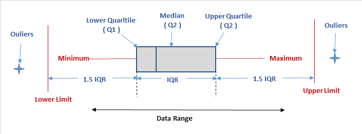

# Anomaly & Outlier 異常值&離群值
## 介紹
異常值&離群值產生通常有可能為人為輸入錯誤或是不合常理的資料，例如：歲數高達2000歲，而離群值會讓我們在建立模型時，對結果產生不良的影響，但是離群值到底範圍多大，有多少個，又要如何發現呢？

## 如何發現離群值Outlier
### ＊ 簡單統計量分析
對資料做描述性統計，最常用**最大最小值**，例如客戶年齡最大值為2000歲，即有異常存在

```python
person['age'].describe()
```

### ＊ 3倍標準差(three-sigma rule of thumb 3σ)-適用於常態分佈的資料
如果資料存在常態分佈，異常值並定義為與**平均值的偏差超過3倍的標準差**（在常態分佈假設下，其距離超過3倍標準差機率為P（｜x-｜>3）≤0.003）
<p>


```python
import numpy
std = std(person['age'])
mean = mean(person['age'])
lower = mean - 3 * std
upper = mean + 3 * std
# 資料範圍從 lower 到 upper
```

### ＊ 箱型圖-Percentile分位數
箱型圖提供了一個判斷異常值X的標準
<br>Q3為下四分位數，代表有四分之一的資料比它小
<br>Q1為上四分位數，代表有四分之一的資料比它大
<br>IQR為四分位數距，上四分位數-下四分位數(Q3-Q1=IQR)
<br>**X < Q1 - 1.5 IQR(Lower Limit) || X > Q3 + 1.5 IQR(Upper Limit)**
<p>
<p>

```python
import numpy
## 找出非離群值範圍
percentile = np.percentile(person['age'],[25,50,75])
iqr = percentile[2] - percentile[0]
lower = percentile[0] - 1.5 * iqr
upper = percentile[2] + 1.5 * iqr
# 資料範圍從 lower 到 upper
```


## 如何處理離群值Outlier
### ＊ 調整
```python
import numpy
#將離群值調整至1到100歲
person['Age'] = person['Age'].clip(1,100)
```
### ＊ 去除
```python
import numpy
#將1到100歲外的離群值去除
keep_index = (person['Age'] > 0) & (person['Age'] < 100)
person = person[keep_index]
```


## Reference
[常態分配68–95–99.7原則](https://zh.wikipedia.org/wiki/68–95–99.7原則)
<br>[利用Python進行異常值分析例項程式碼](https://codertw.com/程式語言/362405/)
<br>[离群值！离群值？离群值！](https://zhuanlan.zhihu.com/p/33468998)
<br>[5 Ways to Detect Outliers/Anomalies That Every Data Scientist Should Know (Python Code)](https://towardsdatascience.com/5-ways-to-detect-outliers-that-every-data-scientist-should-know-python-code-70a54335a623?mkt_tok=eyJpIjoiT1RJNU1XWTVPV0ppWm1KbSIsInQiOiI2K2ZqQlhpNlVlWEpQSGs0bHNYRklUT0hsaDJFbzU5VGgwYnZzYVpkMTVzNlhJaEdudEQ2VFFyMnA2UlBVaWRmbkU0TElNV0Z1dWRvQytuT1RnMWprWk5PdmZNSDZuNmlpTUdIRXNIc2dPZVdIUFdrbVJMUGpCNlZ5NzYyZmZoUyJ9&fbclid=IwAR2TRFfv1UOLF0zOMMwNdvCENMi8xnItR4x3gdl91D6Q20f1tz6Ix3ZNhoc)
