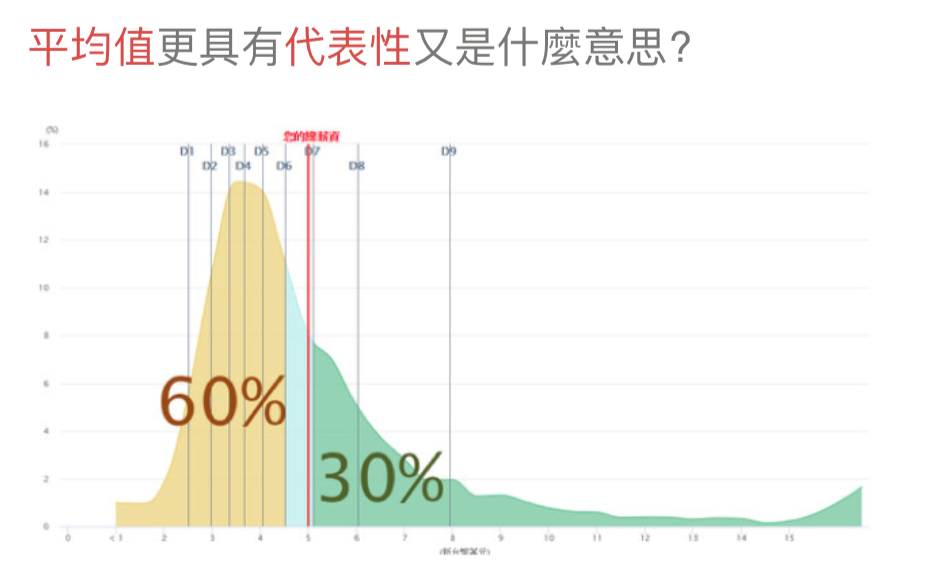

# Remove Skewness 去除偏態
## 介紹
當離群比例太高，平均值沒有代表性可以考慮去除偏態．例如：老師要當掉較少的人，全部人的分數做位移

高薪造成平均值落在較高的地方，使得平均值無法具代表性
<br>
## 分為以下幾類
### ＊ 對數去偏 log1p
自然對數去偏，常見於計數或價格可能**為0的欄位**，因0要對到0建議先加一(plus one)在取對數log，還原使用expm1，取指數exp再減一(minus one)

```python
import numpy as np
price = np.log1p(price)

# 還原
price = np.expm1(price)
```

### ＊ 方根去偏 sqrt
數值減去最小值開根號，例如：成績轉換

```python
import math
grade = math.sqrt(grade - min(grade))
```

### ＊ 分佈去偏 boxcox
boxcox lambda(λ)參數為 0，等於log函數，0.5時為sqrt，**輸入值必須為大於 0**．

<br>

<br>
```python
from scipy import stats
grade = math.sqrt(grade - min(grade))
stats.boxcox(grade, lambda = 0.15)
```


## Reference
[Transforming Skewed Data](https://towardsdatascience.com/transforming-skewed-data-73da4c2d0d16)
