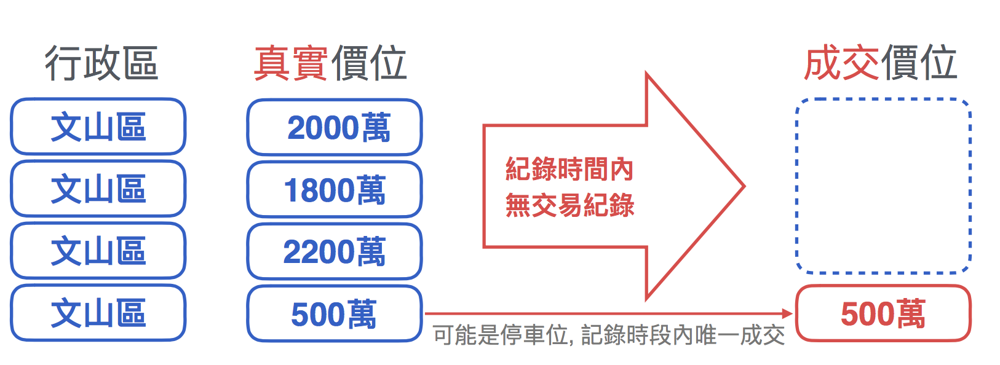
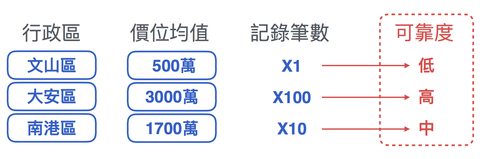

# Categorical Variables 類別變數
## 介紹
此變數代表著某一個狀態、屬性，像是性別、膚色等，又可分為有序 oridnal及無序 nominal，而我們常將文字的訊息轉化成電腦較好處理的訊息．

<br>

## 類別變數分為哪幾類？
* 有序變數 Oridnal Variables
<br>有序變數代表其資料是有順序之分的，如成績分為A++、A+、A、B++、B+、B或著小學、國中、高中、大學，較適合用***Label Encoding***處理

* 無序變數 Non-ordinal/Nominal Variables
<br>無序變數代表資料並無順序，像是髮色、人種等，適合用***One Hot Encoding***處理

## 該如何處理呢？
＊[標籤編碼 Label Encoding](#-標籤編碼-label-encoding)
<br>＊[獨熱編碼 One Hot Encoding](#-獨熱編碼-one-hot-encoding)
<br>＊[均值編碼 Mean Encoding](#-均值編碼-mean-encoding)
<br>＊[計數編碼 Counting Encoding](#-計數編碼-counting-encoding)
<br>＊[特徵雜湊 Feature Hash](#-特徵雜湊-feature-hash)
<br>＊[Conclusion](#-Conclusion)

### ＊ 標籤編碼 Label Encoding
類似流水號，將類別依序填上代碼
<br>

```python
from sklearn.preprocessing import LabelEncode
import numpy as np
taipei = [ ['信義區', 1],
           ['南港區', 2],
           ['大安區', 3],
           ['南港區', 2],
           ['信義區', 0],
           ['文山區', 2]]
taipei = np.array(taipei)
# -----------LabelEncoder-----------
taipei[:, 0] = LabelEncoder().fit_transform(taipei[:, 0])


"""output
       行政區
array([['0', '1'],
       ['1', '2'],
       ['2', '3'],
       ['1', '2'],
       ['0', '0']],
       ['3', '2']],
      dtype='<U4')
"""
```
<p>
<p>
### ＊ 獨熱編碼 One Hot Encoding
將不同類別獨立一欄，並以0和1代表
<br>缺點：浪費記憶體空間與計算時間
<br>

```python
# 第一種做法
import pandas as pd
pd.get_dummies(taipei['行政區'])
```

```python
# 第二種做法
from sklearn.preprocessing import OneHotEncoder
taipei = [ ['信義區', 1],
           ['南港區', 2],
           ['大安區', 3],
           ['南港區', 2],
           ['信義區', 0],
           ['文山區', 2]]
taipei = np.array(taipei)
# -----------One Hot Encoder-----------
enc = preprocessing.OneHotEncoder()
enc.fit(taipei)


"""output
        信義  | 南港 | 大安 | 文山 | 0 | 1 | 2 | 3
array([[ 1.,     0.,    0.,    0.,  0., 1., 0., 0.,],
       [ 0.,     1.,    0.,    0.,  0., 0., 1., 0.,],
       [ 0.,     0.,    1.,    0.,  0., 0., 0., 1.,],
       [ 0.,     1.,    0.,    0.,  0., 0., 1., 0.,],
       [ 1.,     0.,    0.,    0.,  1., 0., 0., 0.,],
       [ 0.,     0.,    0.,    1.,  0., 0., 1., 0.,]])
"""
```
<p>
<p>
### ＊ 均值編碼 Mean Encoding
使用目標平均值，取代原本的類別特徵
<br>適用於與***類別特徵與目標值有顯著相關***，例如：地區與房價
<br>

缺點：樣本少，若只有極端值，平均結果會有誤差，可採用***平滑化Smoothing***，但還是很可能造成***overfitting***
<br>
#### 平滑化 Smoothing
考慮***記錄筆數***，當作可靠度
<br>平均值的***可靠度低***，傾向相信***全部的總平均***
<br>平均值的***可靠度高***，傾向相信***類別的平均***
<p>
<br>新類別均值=(原類別平均*類別樣本數+全部總平均*調整因子)/(類別樣本數+調整因子)
<br>
<!-- $新類別均值 = \frac{(原類別平均 * 類別樣本數 + 全部總平均 * 調整因子)}{類別樣本數 + 調整因子}$ -->

```python
import pandas
data_tmp = taipei.groupby('行政區')
data_tmp = data_tmp['房產價位'].mean()
data_tmp = data_tmp.reset_index()
```
<p>
<br>
### ＊ 計數編碼 Counting Encoding
計算編碼為計算類別在***資料中出現的次數***，當***目標平均值與類別比數呈現正相關/負相關***時，可以考慮使用
<br>補充：count vectorizer為每種詞頻出現的頻率，屬於計數編碼的一種變形
<br>

```python
import pandas
## agg['ROW_NAME':'FUNCTION']
data_count = data.groupby('國別')['國別'].agg[{'計數編碼':'size'}].reset_index()
data = pd.merge(data, data_count, on = '國別', how = 'left')
# 移除原本國別欄位
data = data.drop('國別', axis = 1)
```
<p>
<br>
### ＊ 特徵雜湊 Feature Hash
當***不同類別非常龐大***，可採用雜湊函數（在空間/時間上與鑑別度取折衷），例如姓名要轉換成編碼，每個人的姓名都不重複，使用Hot One Encoding勢必需要很大的記憶體空間，此舉非常不適合
<br>

```python
import numpy
# 這邊的雜湊編碼, 是直接將 'Name' 的名稱放入雜湊函數的輸出數值, 為了要確定是緊密(dense)特徵, 因此除以15後看餘數
# 15 為隨機選擇, 不一定要使用 15, 可以自由選擇夠小的數字試看看. 基本上效果都不會太好
data['Name_hashes'] = data['Name'].map(lambda x:hash(x) % 15)
# 移除姓名欄位
data.drop('Name', axis = 1)
```

### ＊ Conclusion
處理方式         |記憶體空間／計算時間 |適用模型
-------------------|----------------:|-------:
Label Encoding     |小/小             |樹狀模型
One Hot Encoding   |較大/較長          |非樹狀模型
Mean Encoding      |小/小             |
Counting Encoding  |小/小             |
Feature Hash       |小/小             |


## Reference
[Python机器学习中的实用小操作(一)：数据清理篇](https://zhuanlan.zhihu.com/p/29893734)
<br>[数据预处理：独热编码（One-Hot Encoding）和 LabelEncoder标签编码](https://www.twblogs.net/a/5baab6e32b7177781a0e6859/zh-cn/)
<br>[Sklearn 的 OneHotEncoder 說明與簡單範例](https://tree.rocks/python/sklearn-explain-onehotencoder-use/)
<br>[機器學習 ML NOTEOverfitting 過度學習](https://medium.com/雞雞與兔兔的工程世界/機器學習-ml-note-overfitting-過度學習-6196902481bb)
<br>[其他平滑方式：平均数编码：针对高基数定性特征（类别特征）的数据预处理/特征工程](https://zhuanlan.zhihu.com/p/26308272)
<br>[基于sklearn的文本特征抽取](https://www.jianshu.com/p/063840752151)
