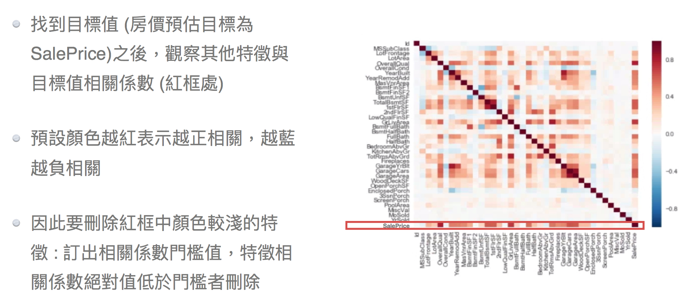

# Feature Selection 特徵選擇
## 介紹
特徵選擇需要適當的減少與增加，以提升精準度並減少計算時間．

## 特徵選擇有哪些方法呢？
＊[過濾法 Filter](#-過濾法-filter)
<br>＊[包裝法 Wrapper](#-包裝法-wrapper)
<br>＊[嵌入法 Embedded](#-嵌入法-embedded)
<br>＊[Conclusion](#-Conclusion)

### ＊ 過濾法 Filter
選定統計數與設定門檻，刪除低於門檻的特徵
#### 相關係數過濾法
1. 找到目標值，觀察其他特徵與目標值相關係數
2. 訂出相關係數門檻值，門檻值>絕對值 將其刪除

<br>

```python
import numpy
corr = df.corr()
rule = (corr['TARGET']>0.1) | (corr['TARGET']<-0.1)
high_corr_mask = list(corr[rule].index)
high_corr_mask.remove('TARGET')
df = df[high_corr_mask]
```

### ＊ 包裝法 Wrapper
根據目標函數，逐步加入特徵或刪除特徵
### ＊ 嵌入法 Embedded
使用機器學習模型，根據擬合後的係數，刪除係數低於門檻的特徵
#### L1嵌入法 Lasso
採用Lasso Regression，調整不同正規化程度，將***特徵值等於0***進行刪除．
<br>

```python
import numpy as np
from sklearn.linear_model import Lasso
L1_Reg = Lasso(alpha = 0.001)
train_X = df.drop('TARGET', axis = 1)
# train_X = MMEncoder.fit_transform(train_X)
train_Y = df['TARGET']
# train_Y = np.lon1p(df['TARGET'])
L1_Reg.fit(train_X, train_Y)
rule = (L1_Reg.coef_>0) | (L1.Reg.coef_<0)
rule = list(rule)
L1_mask = df.columns[rule]
df = df[L1_mask]
```
#### 梯度提升樹嵌入法 GDBT
使用梯度提升樹擬合後，以***特徵節點出現的頻率***當作特徵重要性，刪除重要性低於門檻的特徵．

### ＊ Conclusion
方法         |計算時間|共線性 | 特徵穩定性
-----------:|------:|-----:|---------:
相關係數過濾法|快速    |無法排除|穩定
Lasso嵌入法  |快速    |能排除 |不穩定
GDBT嵌入法   |較慢    |能排除 |穩定

## Reference
[特征选择](https://zhuanlan.zhihu.com/p/32749489)
<br>[特徵選擇 Feature Selection](https://machine-learning-python.kspax.io/intro-1)
