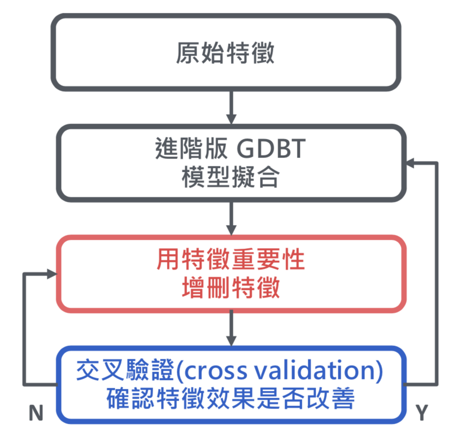
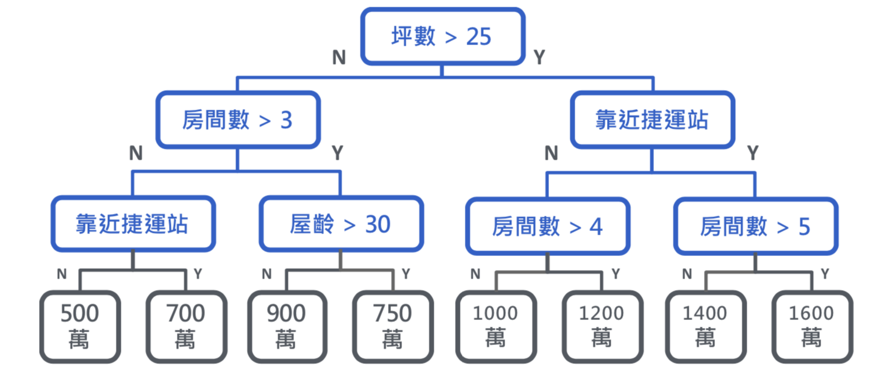
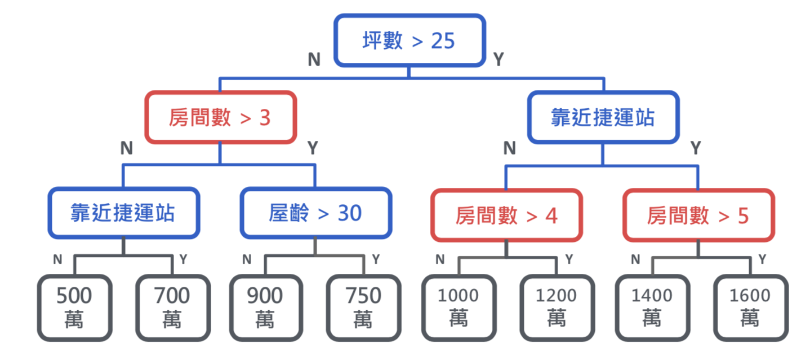
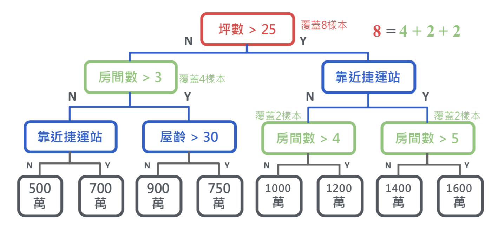

# 29-Feature Evaluation 特徵評估
## 介紹
特徵的重要性將會影響該如何選擇特徵，機器學習的特徵優化流程圖如下圖，而樹狀模型以及非樹狀模型特徵重要性參數並不太一樣。
<br>


## ＊ 樹狀模型-特徵重要性 Feature Importance
此為一個決策樹的案例，該如何判斷特徵重要性
<br>

### 分枝的次數：依據分枝次數大小來決定
坪數ｘ１、房間數ｘ3、靠近捷運站ｘ1、屋齡ｘ1
<br>最重要特徵為 "房間數"
<br>

```python
# 以隨機森林為案例
from sklearn.ensemble import RandomForestClassifier
estimator = RandomForestClassifier()
estimator.fit(train_X, train_Y)
# feature_importances_為採用分枝次數大小（此為預設值）
feats = pd.Series(data=estimator.feature_importances_, index=train_X)
feats.sort_values(ascending=False)
```
### 特徵覆蓋度：觀察該特徵樣本分佈大小決定
坪數覆蓋8個樣本
<br>房間數覆蓋8個樣本（4+2+2）
<br>
### 損失函數 loss function：根據損失函數決定

### Conclusion

方法        |計算時間|估計精確性 | 套件Xgboost| 套件sklean
----------:|------:|--------:|-----------:|---------:
分⽀次數    |最快    |最低      |weight     |預設
分⽀覆蓋度  |快      |中       |cover       |Ｘ
損失降低量  |較慢    |最高     |gain        |X

## ＊ 非樹狀模型-排列重要性 Permutation Importance
將單一特徵的資料排序順序打散，再用原本模型重新預測，並觀察誤差，但較***特徵重要性需更花時間***


## Reference
[机器学习可解释性之排列重要性 Permutation Importance](https://waynehfut.com/2019/03/10/MLExplainbility-2/#简介-introduction)
