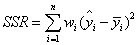

# Evaluation Metrics 評估指標
## 介紹
評估指標用於評估模型預測的準確性，不同評估指標有不同評估準則以及面向，不同類型模型，也採用不同的評估指標，最常見是採用準確率Accuracy，在總樣本數中，可以預測到多少正確分類的樣本數
<br>

### ＊ 回歸 Regression
m 代表資料個數
<br> y<sub>i</sub> 代表觀察值
<br> y<sub>i</sub> 帽子代表預測值
<br>

* MAE (Mean Absolute Error)
<br>範圍： [-∞, ∞]
<br>

```python
from sklearn.metrics import mean_absolute_error
mean_absolute_error(y_test,y_predict)
```
* MSE (Mean Square Error)
<br>範圍： [-∞, ∞]
<br>

```python
from sklearn.metrics import mean_squared_error
mean_squared_error(y_test,y_predict)
```
* R-square
<br>範圍： 0 to 1
<br>其值越接近1，代表方程式的變數對 y 的解釋能力越強
<br>
<br>
<br>

```python
from sklearn.metrics import r2_score
r2_score(y_test,y_predict)
```


### ＊ 分類 Classification
* AUC (Area Under Curve)
<br>範圍：0 to 1

```python
from sklearn.metrics import roc_curve, auc
fpr, tpr, threshold = roc_curve(test_Y, pred_X)
# 面積值 auc
auc(fpr,tpr)
```
可參考 [ROC Curve Note](../Data%20Analysis/ROC%20Curve%20ROC曲線/README.md)

* F1 Score (Precision, Recall)，β = 1
<br>

```python
from sklearn.metrics import f1_score
f1_score(y_test, y_predict)
```

* F2 Score (Precision, Recall)，β = 2
<br>

```python
from sklearn.metrics import precision_score, recall_score
precision = precision_score(y_test, y_predict)
recall = recall_score(y_test, y_predict)
F2 = (1+pow(2,2)) * precision * recall / (pow(2,2) * precision + recall)
```

## Reference
[(未)【博客存档】机器学习模型评估](https://zhuanlan.zhihu.com/p/30721429)
