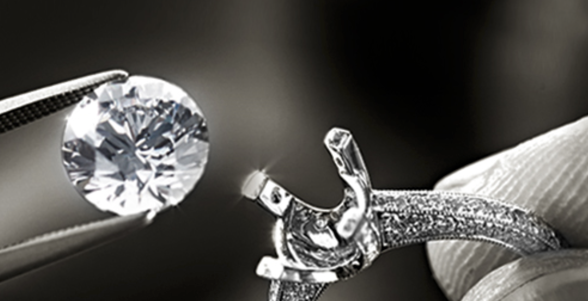
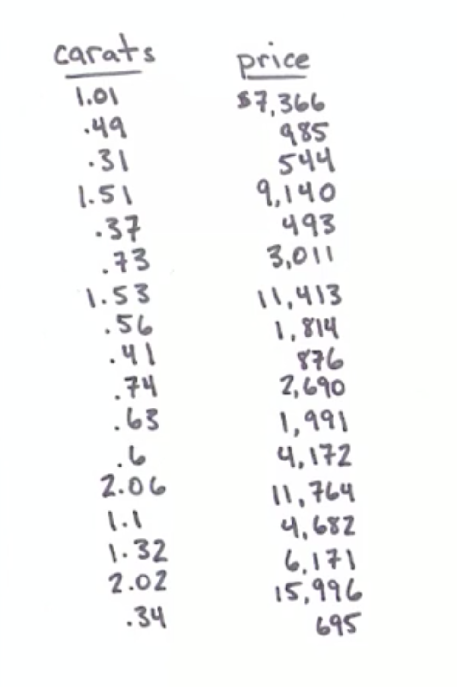
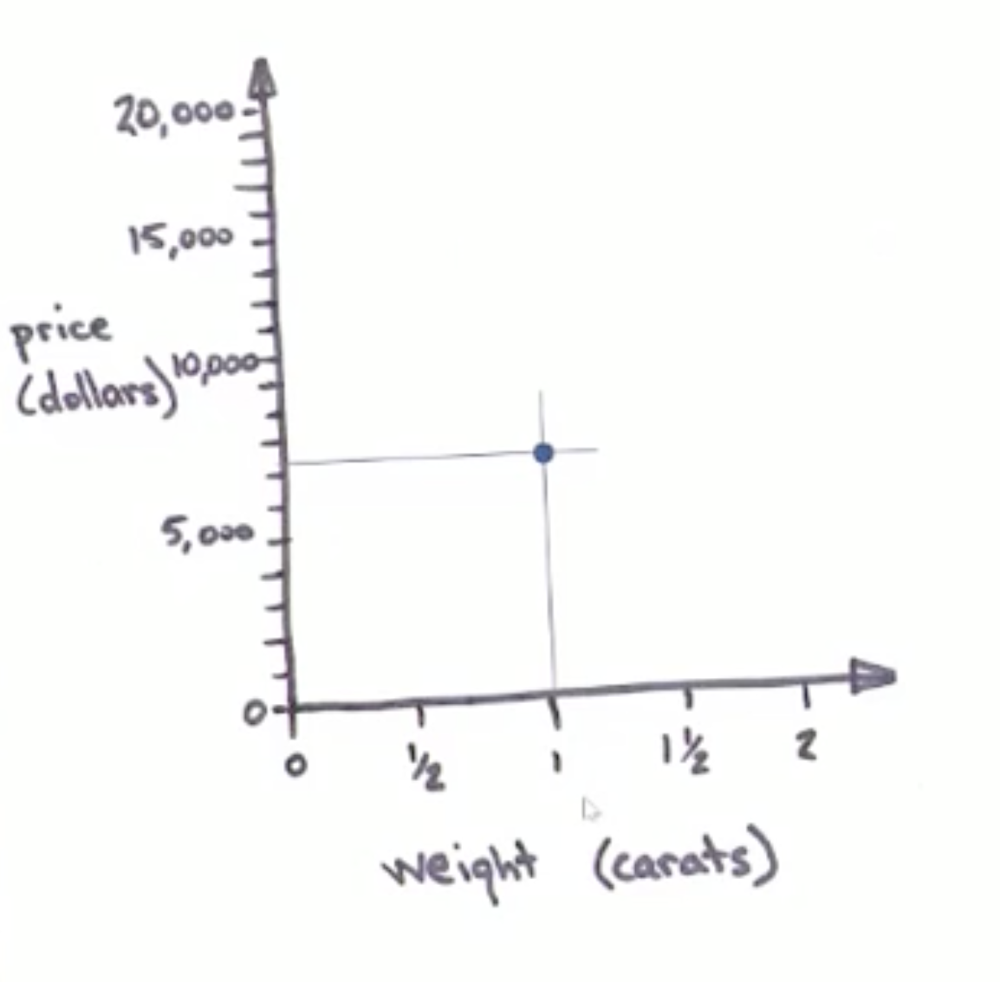
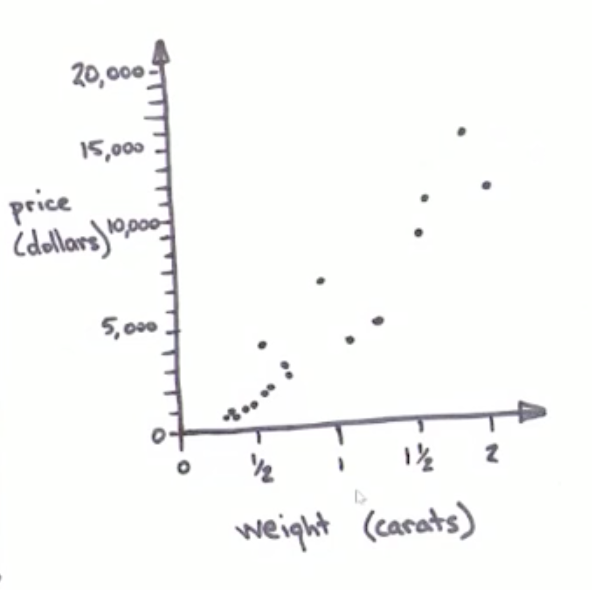

# Linear Regression Model 線性回歸模型
## 介紹

-

 

## 優點

## 案例說明
奶奶留給我一只戒指，上面寫著需要1.35克拉鑽石的戒台Setting，為了修復這只戒指，去找了一間珠寶行詢價
 
到珠寶行後發現店裡沒有1.35克拉的鑽石，也沒有價格，但是我真的很想知道這個鑽石的價錢，所以我將所有的鑽石的尺寸和價錢都抄了下來
 
 
 
並將這些資料製作成x軸與y軸
 
 
 
將所有鑽石及價錢標上
 

## Reference
[線性迴歸的運作原理](https://brohrer.mcknote.com/zh-Hant/how_machine_learning_works/how_linear_regression_works.html)
