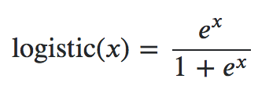
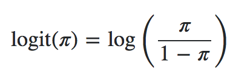

# Logistic Regression Model 邏輯斯回歸模型
## 介紹
屬於二元分類模型，可計算出A類別以及B類別的機率
## 優點
- 資料不需線性可分
- 可獲得A類別和B類別的機率
- 實務上執行速度快

## 缺點
- 分類不夠漂亮（線的切法不夠漂亮）
<br>

## 補充
#### Logit regression 跟 Logistic regression 的差別
Logit function 跟 Logistic function 互為反函數，但兩者皆為相同的模型．
<br>
<br>

## Example
```python
from sklearn.linear_model import LogisticRegression
Logistic_Reg = LogisticRegression().fit(X_train, Y_train)
y_pred = Logistic_Reg.predit(X_test)
```

## Reference
[資料分析&機器學習 第3.3講：線性分類-邏輯斯回歸(Logistic Regression) 介紹](https://medium.com/jameslearningnote/資料分析-機器學習-第3-3講-線性分類-邏輯斯回歸-logistic-regression-介紹-a1a5f47017e5)
<br>[What is the difference between logistic and logit regression?](https://stats.stackexchange.com/questions/120329/what-is-the-difference-between-logistic-and-logit-regression/120364#120364)
<br>[(未)2 WAYS TO IMPLEMENT MULTINOMIAL LOGISTIC REGRESSION IN PYTHON](http://dataaspirant.com/2017/05/15/implement-multinomial-logistic-regression-python/)
