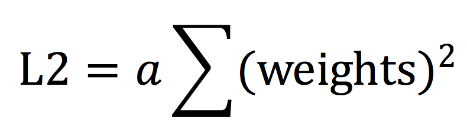

# Ridge Regression 嶺回歸 & Lasso Regrission 套索回歸
## 介紹
當使用最小二乘法，計算線性回歸模型時，資料存在多重共線性，其會對資料雜訊特別敏感，變得極為不穩定，為了解決這問題，可加入正規化，正規化可以懲罰模型的複雜度，當模型越複雜時，其值就會越大
<br>

## Lasso vs Ridge Regression
差別在於正規化的函式不同，分為L1函數以及L2函數，Lasso為Linear Regression加入L1函數，Ridge Regression為Linear Regression加入L2函數
<br>
<br>

## 優缺點
Lasso的正規化特性，會讓模型變得較稀疏，也會讓模型變得更輕量，速度較快，準確率上較無太大差異

```python
# Ridge
from sklearn.linear_model import Ridge
ridge = Ridge(fit_intercept=False)
ridge.fit(X_train, Y_train)
y_pred = ridge.predit(X_test)


# 輸出最佳的alpha值，採用Cross Validation
from sklearn.linear_model import RidgeCV
ridge_CV = RidgeCV(fit_intercept=False)
ridge_CV.fit(X_train, Y_train)
print 'alpha的數值:', ridge_CV.alpha_
print '參數的數值:', ridge_CV.coef_
```

```python

```

## Reference
[脊回归（Ridge Regression）](https://blog.csdn.net/daunxx/article/details/51578787)
<br>[(未)Linear least squares, Lasso,ridge regression有何本质区别？](https://www.zhihu.com/question/38121173)
