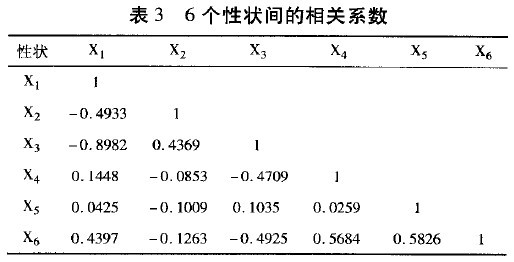

# Correlation coefficient 相關係數
## 介紹
可以表示兩個變數之間的關係，但無法確切證明之間的相關程度
 缺點：若係數接近於1，很可能為假的，當量較小，僅憑相關係數較大就判定有密切的線性關係是不太好的

## 圖例
X1為冬季分櫱，X2為株高，X3為每穗粒數，X4為千粒數，X5為抽穗期，X6為成熟期
 

**結論：** 表3可以看出，冬季分櫱與每穗粒數之間呈現負相關(ρ = − 0.8982)，即麥冬季分櫱越多，那麼每穗的小麥粒數越少，其他性狀之間的關係不顯著．

## 相關係數的家族
* 皮爾森積差相關 Pearson Correlation
* 點二系列相關 Point-biserial Correlation
適用於Categorical Variable，像是男女用1與0表示，或是病人的噁心反應以0、1、2、3作為表示．

* 史皮爾曼等級相關 Spearman rank order correlation

## Reference
[相關係數(Correlation coefficient)](https://wiki.mbalib.com/zh-tw/相关系数)
