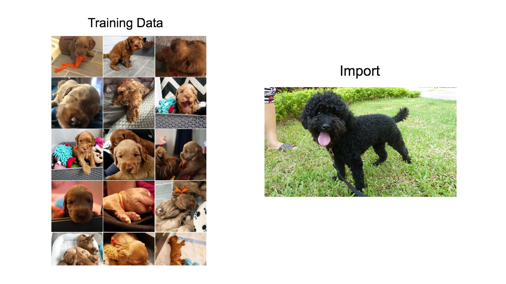

# Overfitting 過適/過擬合
## 介紹
模型的目標是使得損失函數的損失降到最低，但很可能過度學習訓練資料或學習到雜訊值，造成模型無法順利去預測或分辨其他資料．
 
### 案例：
假設要訓練一個模型辨識是不是貴賓狗，這個模型學習到貴賓的特徵：耳朵長而寬，頭較窄且長，尾巴與身體成一斜角，身體背部短之類的特徵，但因為訓練資料都給咖啡色的貴賓狗，模型過度依賴訓練資料把咖啡色的特徵也學習起來，因此在預估的時候遇到黑色的貴賓就會出現準確度的問題，這就是Overfitting。
 

## 產生原因
* 訓練資料過少
* 參數太複雜，功能太強
* 隨機雜訊Stochastic Noise 太多
* 決定性雜訊Deterministic Noise 太多

## 解決方法
* 增加資料量
* 降低模型複雜度
* 使用正規化 Regularization：使其平滑
#### 取得更多資料
## Reference
[機器學習基石 學習筆記 (4)：機器可以怎麼學得更好?](https://www.ycc.idv.tw/ml-course-foundations_4.html)
 [精進魔法 Regularization：減少 Overfitting ，提高模型泛化能力](https://ithelp.ithome.com.tw/articles/10203371)
 [Memorizing is not learning! — 6 tricks to prevent overfitting in machine learning.](https://hackernoon.com/memorizing-is-not-learning-6-tricks-to-prevent-overfitting-in-machine-learning-820b091dc42)
 [機器學習 ML NOTE Overfitting 過度學習](https://medium.com/雞雞與兔兔的工程世界/機器學習-ml-note-overfitting-過度學習-6196902481bb)
